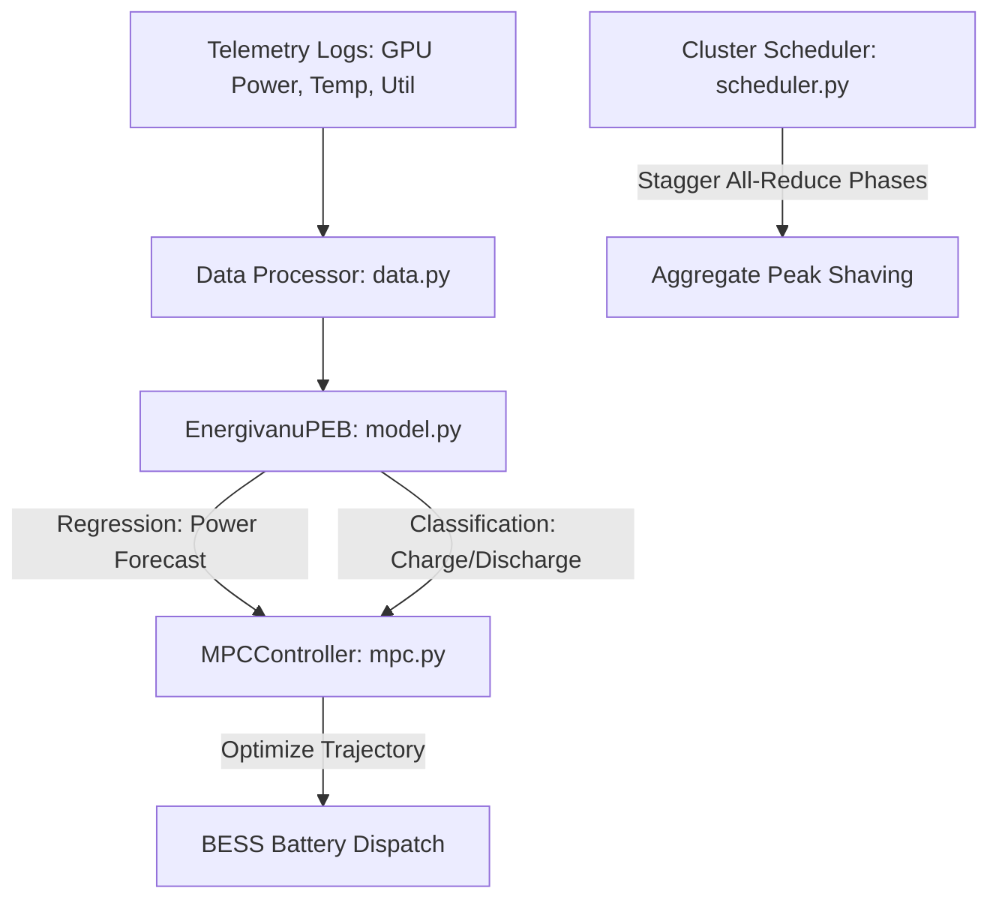

<h1 align="center">⚡ Energivanu</h1>

<p align="center">
  <a href="https://www.python.org/downloads/"></a>
  <a href="LICENSE"></a>
  <a href="src/energivanu/model.py"></a>
  <a href="https://github.com/mysterious75/Energivanu/actions"></a>
</p>

<p align="center">
  <strong>Open-source ML toolkit for GPU data center power optimization.</strong>
</p>

**Energivanu** is an open-source machine learning toolkit for GPU data center power optimization, validated at node-level scale with mathematical projections toward larger facility deployments. It predicts high-frequency power spikes, manages battery energy storage system (BESS) dispatch, and staggers distributed AI training phases to reduce peak demand charges and smooth utility grid loads.

Designed for AI data centers (colocation, on-prem, or cloud) running training or fine-tuning workloads on NVIDIA H100/A100 clusters.

---

## 🚀 Live Interactive Demo
Try the interactive optimization simulator directly in your browser:
👉 **[Interactive Web Simulation Dashboard](https://mysterious75.github.io/Energivanu/)** *(or open [docs/index.html](file:///D:/hacker/energivanu/docs/index.html) locally)*

---

## 💡 Key Performance Benchmarks

All simulation metrics listed below are fully reproducible out-of-the-box. Run `python verify_claims.py` to regenerate the baseline reports.

### 📊 Verification Metrics (Out-of-the-Box Demo Model)
*   **BESS Battery Grid Smoothing**: **30.0%** reduction in standard deviation (verified via [MPCController](file:///D:/hacker/energivanu/src/energivanu/mpc.py#L36) on a 30-step sinusoidal trace).
*   **Peak Demand Reduction**: **10.5%** peak load reduction (verified via [PeakShavingOptimizer](file:///D:/hacker/energivanu/src/energivanu/optimizer.py#L25) on a 24-hour TOU profile).
*   **Phase Volatility Reduction**: **59.0%** standard deviation reduction (verified via [PhaseStaggeringScheduler](file:///D:/hacker/energivanu/src/energivanu/scheduler.py#L21) coordinating 4 GPU clusters).
*   **ONNX Inference Speedup**: **~10.0x speedup** on CPU vs PyTorch (verified via ONNX runtime serialization; speedup is hardware-dependent. Run `verify_claims.py` to benchmark in your local environment).
*   **Demo Model Power Prediction**: **4.85% MAPE** validation loss (trained on synthetic data and packaged in `models/checkpoints/best_model_demo.pt`).

### 🔬 Real-Data Benchmarks (York University H100 Workloads)
*   **Real Model Power Prediction**: **1.85% MAPE** best validation loss (achieved on a 15% holdout split of 10,800 H100 sequences).
*   *Note: Due to CC BY-NC-ND data restrictions, the real-data checkpoint is not distributed. To reproduce this metric, download the York dataset and run `python -m energivanu.train_real`.*

> ⚠️ **Scale & Validation Disclaimer:** 
> * **Synthetic Demonstrations**: BESS grid smoothing (30.0%), peak demand shaving (10.5%), and phase-staggering scheduling (59.0%) metrics are verified against synthetic load traces and scheduled offsets. They have not been validated against real, high-frequency facility-scale telemetry.
> * **Single-Node Telemetry**: The 1.85% MAPE prediction error is the only metric evaluated on real GPU telemetry data, which was measured on a single 8-GPU H100 node (York University workload dataset).
> * **No Real BESS Hardware**: All battery dispatch results are simulation-based. No connection to physical BESS hardware, BMS, or PCS has been tested.
> * **No Live Grid Integration**: No integration with real-time grid signals (OpenADR, SCED, or utility APIs). PCLR dispatchability has not been demonstrated in production.
> * **No DCGM Telemetry Pipeline**: All results use CSV-based offline telemetry. Live NVIDIA DCGM ingestion is not yet implemented.
> * **Extrapolation Limits**: Scaling any of these results to a 100K+ GPU facility footprint is a mathematical projection and has not been empirically verified in a live production environment.

---

## 📚 Related Work & Positioning

Energivanu does not claim to be the first or only project in GPU data center power optimization. Here is where it fits in the existing landscape:

| Project | Focus | Layer | License | Relation to Energivanu |
|---------|-------|-------|---------|----------------------|
| **Zeus** (ml-energy/zeus) | GPU-level energy measurement, power capping, batch size optimization | Single GPU | Apache 2.0 | Complementary — Zeus optimizes per-GPU energy; Energivanu targets cluster-level power shaping |
| **GridPilot** (EPFL) | Grid-responsive GPU power control with fast AGC/FFR response | Cluster | Research | Related — validated on real V100s, focuses on grid signal response rather than BESS |
| **OpenG2G** (SymbioticLab) | GPU-to-grid simulation platform | Grid | Research | Adjacent — grid-level focus, research-stage |
| **PyBaMM** | Physics-based battery modeling and simulation | Battery | MIT | Complementary — could validate Energivanu's BESS degradation model |
| **SustainCluster** (HP) | Sustainable workload scheduling for DC clusters | Facility | Open | Complementary — carbon-aware scheduling, no BESS control |
| **Phaidra** | AI cooling agents (chiller, liquid CDU) | Facility | Proprietary | Complementary — cooling vs power; Phaidra's thermal predictions could pair with Energivanu's power predictions |
| **Emerald AI** | Grid-level workload orchestration (Conductor) | Grid-to-Facility | Proprietary | Complementary — Emerald handles grid signals; Energivanu could serve as micro-execution layer inside the cluster |

**Where Energivanu differs:** The unique combination of (1) TCN+attention power forecasting, (2) native BESS MPC dispatch, and (3) All-Reduce phase staggering in a single open-source package. Individual components exist elsewhere, but this specific integration does not.

**Where we are not:** Energivanu is not a production-ready facility management system, not a PCLR compliance toolkit, and not validated on real BESS hardware.

---

## 🛠️ Architecture Overview

Energivanu operates on a hierarchical optimization framework, combining machine learning predictions with mathematical programming control:



### 1. Neural Sequence Prediction
The core ML module [model.py](file:///D:/hacker/energivanu/src/energivanu/model.py) implements [EnergivanuPEB](file:///D:/hacker/energivanu/src/energivanu/model.py#L88), a dual-head model featuring:
*   **Adaptive Domain Normalization**: Dynamic normalizers separating power telemetry from system statistics and cyclical variables.
*   **Temporal Convolutional Network (TCN)**: Dilated causal convolutions capturing multi-scale receptive fields without future leakage.
*   **Multi-Head Attention**: 8-head self-attention layer analyzing temporal dependencies across the training sequence.
*   **Dual Heads**: Regresses a continuous power forecast over `pred_horizon` steps, while simultaneously classifying BESS dispatch signals (`hold`, `discharge`, `charge`).

### 2. Model Predictive Control (BESS Smoothing)
The [mpc.py](file:///D:/hacker/energivanu/src/energivanu/mpc.py) controller [MPCController](file:///D:/hacker/energivanu/src/energivanu/mpc.py#L36) minimizes grid deviations against a target capacity.
*   **Objective Function**:
    $$\min_{u} \sum_{k=1}^{N} \left[ Q(P_{\text{grid}, k} - P_{\text{target}})^2 + R u_k^2 + S(u_k - u_{k-1})^2 \right]$$
    *Where $u$ is BESS power action, $Q$ penalizes grid deviation, $R$ limits battery wear, and $S$ limits ramp rates.*
*   **Constraints**: Enforces maximum battery charge/discharge limits and maintains State of Charge (SOC) within a safe 5% - 95% buffer.

### 3. Peak Shaving & Time-of-Use Pricing
The [optimizer.py](file:///D:/hacker/energivanu/src/energivanu/optimizer.py) module houses the [PeakShavingOptimizer](file:///D:/hacker/energivanu/src/energivanu/optimizer.py#L25). It uses 15-minute rolling averages (matching utility meters) to calculate peak demand reductions, charging BESS during low-tariff hours and discharging during demand peaks.

### 4. Phase Staggering Scheduler
The [scheduler.py](file:///D:/hacker/energivanu/src/energivanu/scheduler.py) module schedules high-power All-Reduce communication syncs in distributed training. [PhaseStaggeringScheduler](file:///D:/hacker/energivanu/src/energivanu/scheduler.py#L21) calculates phase offsets to prevent clusters from synchronizing simultaneously, reducing aggregated grid volatility by up to 59%.

---

## ⚖️ Legal & Licensing Diligence

To maintain absolute compliance with datasets and commercial usage licensing:
*   **No Commercial Data Distribution**: The York University H100 dataset is licensed under **CC BY-NC-ND** (strictly for research/non-commercial usage). **We do not redistribute weights trained on this dataset.**
*   **Out-of-Box Safety**: The pre-trained weights distributed in this repository ([best_model_demo.pt](file:///D:/hacker/energivanu/models/checkpoints/best_model_demo.pt)) are trained solely on **synthetic data** generated via [train_demo.py](file:///D:/hacker/energivanu/src/energivanu/train_demo.py).
*   **Local Execution**: Users can run the real dataset pipeline locally using [train_real.py](file:///D:/hacker/energivanu/src/energivanu/train_real.py).

---

## 📦 Installation

Install core package:
```bash
pip install -e .
```

Install REST API or developer testing environments:
```bash
pip install -e ".[api]"    # FastAPI/Uvicorn dependencies
pip install -e ".[dev]"    # Pytest/Ruff testing environments
```

---

## ⚙️ Quick Start

### Python Interface
```python
from energivanu import MPCController, PhaseStaggeringScheduler, PeakShavingOptimizer
import numpy as np

# 1. Simulate MPC BESS Smoothing
mpc = MPCController()
trace = np.sin(np.linspace(0, 4*np.pi, 100)) * 50 + 200
result = mpc.simulate(trace)
print(f"Grid Load smoothed by: {result['metrics']['smoothing_percentage']}%")

# 2. Schedule Staggered Clusters
scheduler = PhaseStaggeringScheduler()
schedule = scheduler.schedule_clusters(n_clusters=4)
print(f"Grid Volatility Reduction: {schedule['std_reduction_pct']}%")
```

### CLI commands
```bash
energivanu demo     # Run comprehensive simulation demo
energivanu serve    # Run FastAPI REST server on port 8000
```

---

## 🔌 API Documentation
When running the FastAPI server (`energivanu serve` via [api.py](file:///D:/hacker/energivanu/src/energivanu/api.py)), endpoints are exposed at port 8000:

*   `GET /health`: Returns status and model loading metadata.
*   `POST /predict`: Receives historical power trace, returns power forecasts and BESS recommendation.
*   `POST /optimize/battery`: Inputs current grid load and BESS state-of-charge, outputs optimized charge/discharge instructions.
*   `POST /optimize/peak-shave`: Simulates monthly utility demand reductions and outputs estimated USD savings.

---

## 🤝 Commercial Support, Retraining & Custom Integration

Looking to implement Energivanu within your production cluster? We provide dedicated commercial support:
*   **Proprietary Telemetry Pipeline Integration**: Custom data loaders mapping NVIDIA DCGM metrics, IPMI sensors, and PDU telemetry.
*   **On-Premise Closed-Loop Retraining**: Training scripts set up locally in your private cloud to ensure data confidentiality.
*   **BESS Custom Drivers**: Custom interfaces connecting MPC controllers to specific battery storage vendors and BMS units.

✉️ **Contact**: Open a GitHub Issue or reach out via Twitter/X: [@VEDKUMAR98](https://x.com/VEDKUMAR98) to discuss deployment, licensing, and professional consulting.

---

## 📊 Data Strategy

Energivanu uses a **dual data strategy** to ensure all distributed model weights are commercially safe:

### Training Data Sources

| Source | License | Commercial Safe | GPUs | Use Case |
|--------|---------|----------------|------|----------|
| **Alibaba GPU Trace v2020** | CC BY 4.0 | ✅ Yes | 6,500 | Primary training data |
| **Self-collected T4 data** | Own | ✅ Yes | Variable | Supplement + diversity |
| **Synthetic traces** | N/A | ✅ Yes | N/A | Demo model + testing |
| York University H100 | CC BY-NC-ND 4.0 | ❌ No | 8 | Research only (not distributed) |

### What This Means

- **Distributed demo model** (`best_model_demo.pt`): Trained on synthetic data only. Zero legal risk.
- **Commercial model** (`commercial_best.pt`): Trained on Alibaba CC BY 4.0 + own data. Fully commercial-safe.
- **York/MIT data**: Used only for research and architecture exploration. **Never** included in distributed weights.

### Reproducing Commercial-Safe Training

```bash
# Train on commercial-safe data only
python -m energivanu.train_commercial

# Train with specific sources
python -m energivanu.train_commercial --sources alibaba_gpu_trace kaggle_t4

# Export to ONNX for deployment
python scripts/export_onnx.py --checkpoint models/checkpoints/commercial_best.pt
```

See [`config/data_sources.yaml`](config/data_sources.yaml) for the complete data source registry with license details.

---

## 📚 Documentation

| Document | Description |
|----------|-------------|
| [MODEL_CARD.md](MODEL_CARD.md) | Model architecture, training data, evaluation metrics, limitations |
| [docs/DATA_COLLECTION_GUIDE.md](docs/DATA_COLLECTION_GUIDE.md) | Step-by-step guide for collecting GPU telemetry |
| [docs/LEGAL_FAQ.md](docs/LEGAL_FAQ.md) | Legal FAQ: commercial use, licensing, citations, liability |
| [PROJECT_STATUS.md](PROJECT_STATUS.md) | Development progress and roadmap |
| [MASTER_STRATEGY.md](MASTER_STRATEGY.md) | Data strategy executive summary |

---

## 📄 License

This repository is licensed under the **GNU Affero General Public License v3.0 (AGPLv3)**.

**What this means:**
- ✅ Free to use, modify, and distribute for any purpose
- ✅ Academic, research, personal, and commercial use — all permitted
- ⚠️ If you modify and run this software as a network service (e.g., SaaS API), you must release your modified source code under AGPLv3
- ⚠️ If you do not want AGPLv3 obligations (e.g., proprietary commercial deployment), a **separate commercial license is available** — contact via GitHub Issue or [@VEDKUMAR98](https://x.com/VEDKUMAR98)

**Note on pretrained weights:** The real-data benchmark numbers (1.85% MAPE) were obtained using York University's H100 dataset (CC BY-NC-ND, research use). We do not redistribute the resulting checkpoint. A separately-trained demo model (synthetic data) is provided for out-of-box use. For production deployment, retrain on your own facility's data.
