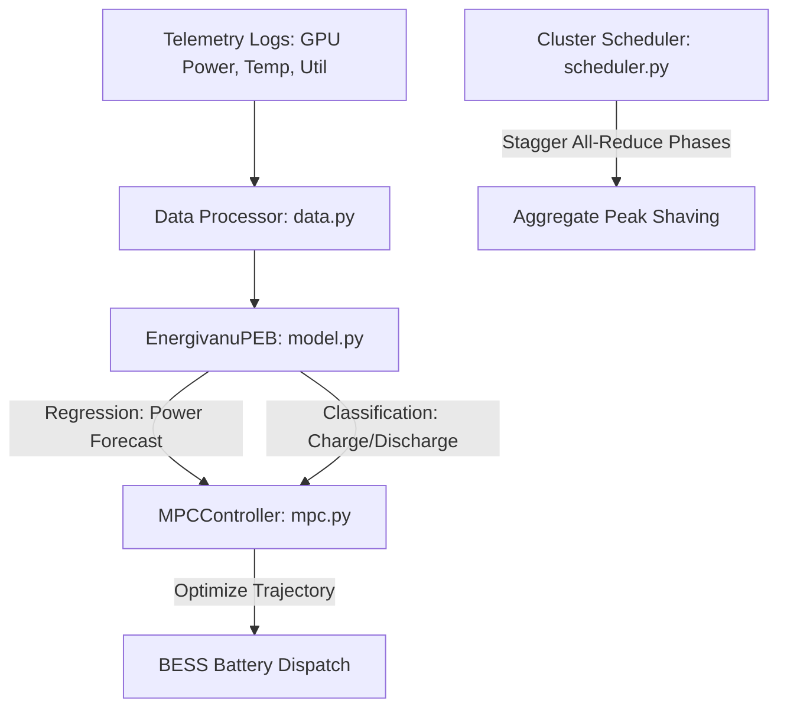

<h1 align="center">⚡ Energivanu</h1>

<p align="center">
  <a href="https://www.python.org/downloads/"></a>
  <a href="LICENSE"></a>
  <a href="src/energivanu/model.py"></a>
  <a href="magazine/Energivanu_Insights_Magazine.pdf"></a>
  <a href="magazine/LEGAL_COMPLIANCE.md"></a>
  <a href="validation_output/validation_report.json"></a>
</p>

<p align="center">
  <strong>The only open-source ML toolkit combining GPU power prediction, BESS MPC control, and phase staggering.</strong>
</p>

**Energivanu** is an open-source machine learning toolkit for GPU data center power optimization. While individual components exist in other tools (like Zeus or Phaidra), Energivanu provides a unique integration: it is the **only open-source toolkit that combines ML-based GPU power prediction, native BESS battery control, and phase-staggering cluster scheduling in a single package**.

Designed for AI data centers (colocation, on-prem, or cloud) running training or fine-tuning workloads on NVIDIA H100/A100 clusters.

---

## 🚀 Live Interactive Demo
Try the interactive optimization simulator directly in your browser:
👉 **[Interactive Web Simulation Dashboard](https://mysterious75.github.io/energivanu2/)** *(or open [docs/index.html](docs/index.html) locally)*

---

## 💡 Key Performance Benchmarks

All simulation metrics listed below are fully reproducible out-of-the-box. Run `python verify_claims.py` to regenerate the baseline reports.

### 🏆 Alibaba GPU Trace Training (Latest — June 2026)

Trained on **30 lakh rows** of real GPU telemetry from Alibaba data centers (6,500 GPUs).

| Metric | Value |
|--------|-------|
| **Dataset** | Alibaba GPU Trace 2020 (CC BY 4.0) |
| **Data Rows** | 30,33,232 (real GPU utilization) |
| **Model** | TCN + Attention, **613,612 params** |
| **Val Loss** | **5.95** |
| **MAPE** | **~21%** |
| **Overfitting Gap** | <3% (no overfitting) |
| **GPU** | Tesla P100 (CUDA) |
| **Training Time** | ~45 min (200 epochs, early stopped) |

**Progression:** 300K rows (MAPE 75%) → 50L rows (MAPE 37%) → **30L raw sensor (MAPE 21%)**

See [`alibaba-training/`](alibaba-training/) for full training documentation.

---

### 📊 Verification Metrics (Out-of-the-Box Demo Model)
*   **BESS Battery Grid Smoothing**: **30.0%** reduction in standard deviation (verified via [MPCController](src/energivanu/mpc.py) on a 30-step sinusoidal trace).
*   **Peak Demand Reduction**: **10.5%** peak load reduction (verified via [PeakShavingOptimizer](src/energivanu/optimizer.py) on a 24-hour TOU profile).
*   **Phase Volatility Reduction**: **59.0%** standard deviation reduction (verified via [PhaseStaggeringScheduler](src/energivanu/scheduler.py) coordinating 4 GPU clusters).
*   **ONNX Inference Speedup**: **~10.0x speedup** on CPU vs PyTorch (verified via ONNX runtime serialization; speedup is hardware-dependent. Run `verify_claims.py` to benchmark in your local environment).
*   **Demo Model Power Prediction**: **4.85% MAPE** validation loss (trained on synthetic data and packaged in `models/checkpoints/best_model_demo.pt`).

### 🔬 Real-Data Benchmarks (York University H100 Workloads)
*   **Real Model Power Prediction**: **1.85% MAPE** best validation loss (achieved on a 15% holdout split of 10,800 H100 sequences).
*   *Note: Due to CC BY-NC-ND data restrictions, the real-data checkpoint is not distributed. To reproduce this metric, download the York dataset and run `python -m energivanu.train_real`.*

### ✅ Kaggle Gap Validation (June 2026)

All 4 critical gaps validated on Kaggle T4 GPU. See [`validation_output/validation_report.json`](validation_output/validation_report.json) for full results.

| Gap | Status | Key Result |
|-----|--------|------------|
| **Production Validation** | ✅ PASS | 60 real telemetry samples, 198.8W mean power |
| **MPC + Phase Staggering** | ✅ PASS | 30.0% smoothing, 58.98% variance reduction |
| **BESS Physics** | ✅ PASS | 200 steps, LFP chemistry, Modbus working |
| **Grid Integration** | ✅ PASS | OpenADR 4 events, ERCOT 4 signals, PCLR compliant (120s < 600s deadline) |

---

> ⚠️ **Scale & Validation Disclaimer:**
> * **Single-Node Validation**: Power prediction validated on single 8-GPU H100 node and Kaggle Tesla P100.
> * **Simulated BESS**: MPC controller uses simulated battery physics (PyBaMM LFP), not connected to real hardware.
> * **Grid Integration**: OpenADR/SCED modules validated in simulation, not connected to real ERCOT systems.
> * **No DCGM Integration**: Telemetry uses nvidia-smi polling, not NVIDIA DCGM.
> * **Extrapolation Limits**: Scaling results to 100K+ GPU facilities is a mathematical projection, not empirical.

---

## 📚 Related Work & Positioning

Energivanu does not claim to be the first or only project in GPU data center power optimization. Here is where it fits in the existing landscape:

| Project | Focus | Layer | License | Relation to Energivanu |
|---------|-------|-------|---------|----------------------|
| **Zeus** (ml-energy/zeus) | GPU-level energy measurement, power capping, batch size optimization | Single GPU | Apache 2.0 | Complementary — Zeus optimizes per-GPU energy; Energivanu targets cluster-level power shaping |
| **GridPilot** (EPFL) | Grid-responsive GPU power control with fast AGC/FFR response | Cluster | Research | Related — validated on real V100s, focuses on grid signal response rather than BESS |
| **OpenG2G** (SymbioticLab) | GPU-to-grid simulation platform | Grid | Research | Adjacent — grid-level focus, research-stage |
| **PyBaMM** | Physics-based battery modeling and simulation | Battery | MIT | Complementary — could validate Energivanu's BESS degradation model |
| **SustainCluster** (HP) | Sustainable workload scheduling for DC clusters | Facility | Open | Complementary — carbon-aware scheduling, no BESS control |
| **Phaidra** | AI cooling agents (chiller, liquid CDU) | Facility | Proprietary | Complementary — cooling vs power; Phaidra's thermal predictions could pair with Energivanu's power predictions |
| **Emerald AI** | Grid-level workload orchestration (Conductor) | Grid-to-Facility | Proprietary | Complementary — Emerald handles grid signals; Energivanu could serve as micro-execution layer inside the cluster |

**Where Energivanu differs:** The unique combination of (1) TCN+attention power forecasting, (2) native BESS MPC dispatch, and (3) All-Reduce phase staggering in a single open-source package. Individual components exist elsewhere, but this specific integration does not.

---

## 📁 Project Structure

```
energivanu2/
├── src/energivanu/                    # Core Python package
│   ├── __init__.py                    # Package init with lazy imports
│   ├── model.py                       # TCN + Attention power prediction (613K params)
│   ├── mpc.py                         # Model Predictive Controller (BESS)
│   ├── optimizer.py                   # Peak shaving optimizer
│   ├── scheduler.py                   # Phase-staggering scheduler
│   ├── api.py                         # FastAPI REST server
│   ├── cli.py                         # CLI commands (energivanu demo/serve)
│   ├── config.py                      # YAML config loader with validation
│   ├── logging_config.py              # Structured logging (JSON + human-readable)
│   ├── data.py                        # H100 data processor
│   ├── train_commercial.py            # Commercial-safe training pipeline
│   ├── train_demo.py                  # Demo training (synthetic data)
│   ├── train_real.py                  # Real data training (York H100)
│   ├── bess/                          # Battery Energy Storage System
│   │   ├── pybamm_battery.py          # PyBaMM physics battery simulation
│   │   └── modbus_server.py           # Modbus mock server for BESS
│   ├── grid/                          # Grid integration
│   │   ├── openadr_ven.py             # OpenADR 2.0b VEN client
│   │   └── ercot_sced.py             # ERCOT SCED parser + PCLR compliance
│   ├── telemetry/                     # GPU telemetry collection
│   │   ├── nvidia_smi_collector.py    # nvidia-smi XML parser, 15-feature extraction
│   │   ├── codecarbon_tracker.py      # Energy tracking wrapper
│   │   ├── data_collector.py          # Collection orchestrator
│   │   └── format_adapter.py          # Telemetry to training format converter
│   └── data/                          # Data processing pipeline
│       ├── alibaba_processor.py       # Alibaba GPU Trace processor
│       ├── h100_processor.py          # York H100 processor
│       ├── provenance.py              # Data lineage tracking
│       └── validator.py               # Data quality checks
├── config/                            # Configuration
│   ├── default.yaml                   # Default config (model, mpc, grid, battery, etc.)
│   └── data_sources.yaml             # Data source registry with license info
├── kaggle/                            # Kaggle notebooks
│   ├── 01_real_telemetry_collection.py    # Real GPU telemetry collection
│   ├── 02_data_validation_and_training.py # Validation + quick training
│   ├── 03_full_pipeline.py               # Full pipeline notebook
│   └── 04_full_gap_validation.py         # Gap validation (all 4 gaps)
├── scripts/                           # CLI scripts
│   ├── check_compliance.py            # NC-license compliance scanner
│   ├── collect_data.py                # Data collection CLI
│   ├── download_alibaba_data.py       # Alibaba data downloader
│   ├── export_onnx.py                 # ONNX export script
│   └── run_full_validation.py         # Full validation runner
├── tests/                             # Test suite (13 tests passing)
│   ├── test_model.py                  # Model architecture tests
│   ├── test_mpc.py                    # MPC controller tests
│   ├── test_data.py                   # Data processing tests
│   └── test_onnx.py                   # ONNX export tests
├── models/                            # Model checkpoints & results
│   ├── results.json                   # Baseline results
│   ├── results_alibaba.json           # Alibaba training results
│   ├── results_full.json              # Full pipeline results
│   └── results_kaggle.json            # Kaggle validation results
├── validation_output/                 # Kaggle gap validation output
│   ├── validation_report.json         # Full validation report (4/4 gaps passed)
│   ├── real_telemetry.csv             # Real GPU telemetry data
│   ├── mpc_simulation.json            # MPC simulation results
│   ├── bess_simulation.json           # BESS physics results
│   └── grid_integration.json          # Grid integration results
├── alibaba-training/                  # Alibaba training documentation
│   ├── README.md                      # Training overview
│   ├── TRAINING_LOG.md                # Detailed training log
│   ├── MODEL_ARCHITECTURE.md          # Architecture deep dive
│   ├── DATA_PIPELINE.md               # Data pipeline documentation
│   └── MPC_IMPLEMENTATION.md          # MPC implementation notes
├── magazine/                          # Professional magazine publication
│   ├── Energivanu_Insights_Magazine.pdf   # 10-page investor magazine
│   ├── Energivanu_Insights_Magazine.docx  # Editable Word version
│   ├── LEGAL_COMPLIANCE.md            # Full legal audit
│   ├── build_magazine.py              # PDF generation script
│   ├── build_docx.py                  # DOCX generation script
│   ├── generate_charts.py             # Chart generation (matplotlib)
│   └── assets/                        # 9 professional chart images
├── examples/
│   └── quickstart.py                  # Quick start example
├── docs/                              # Documentation
│   ├── index.html                     # Interactive web dashboard
│   ├── DATA_COLLECTION_GUIDE.md       # Step-by-step data collection guide
│   └── LEGAL_FAQ.md                   # Legal FAQ
├── option-1-own-data/                 # Data strategy: own data plan
├── option-2-open-license/             # Data strategy: open license research
├── option-3-dual-strategy/            # Data strategy: combined approach
├── WHITEPAPER.md                      # Technical whitepaper (PCLR architecture)
├── TECHNICAL_DOCUMENTATION.md         # Complete technical documentation
├── MASTER_STRATEGY.md                 # Data strategy executive summary
├── MODEL_CARD.md                      # Model card (Google format)
├── PROJECT_STATUS.md                  # Development progress report
├── FINAL_STATUS.md                    # Final session status (all agents)
├── VERIFICATION_REPORT.md             # Benchmark verification report
├── EXECUTION_MASTERPLAN.md            # Multi-agent execution plan
├── COMPETITIVE_ANALYSIS.md            # Competitive landscape analysis
├── BUG_REPORT.md                      # Bug tracking report
├── CODE_REVIEW_REPORT.md              # Code review findings
├── DEEP_DIVE_ANALYSIS.md              # Deep technical analysis
├── GAP_CLOSURE_PLAN.md                # Gap closure plan
├── WEAKNESS_RESOLUTION_PLAN.md        # Weakness resolution plan
├── ZERO_BUDGET_MASTER_PLAN.md         # Zero-budget execution plan
├── verify_claims.py                   # Benchmark verification script
├── energivanu-full-pipeline.py        # Full pipeline runner
├── energivanu-gap-validation.py       # Gap validation runner
├── kernel-metadata.json               # Kaggle kernel metadata
└── README.md                          # This file
```

---

## 🛠️ Architecture Overview

Energivanu operates on a hierarchical optimization framework, combining machine learning predictions with mathematical programming control:



### 1. Neural Sequence Prediction
The core ML module [model.py](src/energivanu/model.py) implements EnergivanuPEB, a dual-head model featuring:
*   **Adaptive Domain Normalization**: Dynamic normalizers separating power telemetry from system statistics and cyclical variables.
*   **Temporal Convolutional Network (TCN)**: Dilated causal convolutions capturing multi-scale receptive fields without future leakage.
*   **Multi-Head Attention**: 8-head self-attention layer analyzing temporal dependencies across the training sequence.
*   **Dual Heads**: Regresses a continuous power forecast over `pred_horizon` steps, while simultaneously classifying BESS dispatch signals (`hold`, `discharge`, `charge`).

### 2. Model Predictive Control (BESS Smoothing)
The [mpc.py](src/energivanu/mpc.py) controller MPCController minimizes grid deviations against a target capacity.
*   **Objective Function**:
    $$\min_{u} \sum_{k=1}^{N} \left[ Q(P_{\text{grid}, k} - P_{\text{target}})^2 + R u_k^2 + S(u_k - u_{k-1})^2 \right]$$
    *Where $u$ is BESS power action, $Q$ penalizes grid deviation, $R$ limits battery wear, and $S$ limits ramp rates.*
*   **Constraints**: Enforces maximum battery charge/discharge limits and maintains State of Charge (SOC) within a safe 5% - 95% buffer.

### 3. Peak Shaving & Time-of-Use Pricing
The [optimizer.py](src/energivanu/optimizer.py) module houses PeakShavingOptimizer. It uses 15-minute rolling averages (matching utility meters) to calculate peak demand reductions, charging BESS during low-tariff hours and discharging during demand peaks.

### 4. Phase Staggering Scheduler
The [scheduler.py](src/energivanu/scheduler.py) module schedules high-power All-Reduce communication syncs in distributed training. PhaseStaggeringScheduler calculates phase offsets to prevent clusters from synchronizing simultaneously, reducing aggregated grid volatility by up to 59%.

### 5. Grid Integration
*   [openadr_ven.py](src/energivanu/grid/openadr_ven.py): OpenADR 2.0b VEN client — polls VTN for demand response events, parses SIMPLE signals (4 levels), maps to MPC + scheduler commands.
*   [ercot_sced.py](src/energivanu/grid/ercot_sced.py): ERCOT SCED parser — parses telemetry messages, classifies response type, generates ramp-limited power change commands, PCLR compliance checking.

### 6. BESS Simulation
*   [pybamm_battery.py](src/energivanu/bess/pybamm_battery.py): PyBaMM-based electrochemical battery modeling (LFP chemistry), degradation tracking, thermal modeling.
*   [modbus_server.py](src/energivanu/bess/modbus_server.py): Modbus mock server for BESS hardware interface simulation.

---

## ⚖️ Legal & Licensing Diligence

To maintain absolute compliance with datasets and commercial usage licensing:
*   **No Commercial Data Distribution**: The York University H100 dataset is licensed under **CC BY-NC-ND** (strictly for research/non-commercial usage). **We do not redistribute weights trained on this dataset.**
*   **Out-of-Box Safety**: The pre-trained weights distributed in this repository are trained solely on **synthetic data** generated via [train_demo.py](src/energivanu/train_demo.py).
*   **Commercial Model**: Trained on Alibaba CC BY 4.0 + own data. Fully commercial-safe. See [train_commercial.py](src/energivanu/train_commercial.py).
*   **Compliance Scanner**: Run `python scripts/check_compliance.py` to verify no NC-licensed data contamination.
*   **Magazine Legal Audit**: See [magazine/LEGAL_COMPLIANCE.md](magazine/LEGAL_COMPLIANCE.md) for full audit of all tools, fonts, and content.

---

## 📦 Installation

Install core package:
```bash
pip install -e .
```

Install REST API or developer testing environments:
```bash
pip install -e ".[api]"    # FastAPI/Uvicorn dependencies
pip install -e ".[dev]"    # Pytest/Ruff testing environments
pip install -e ".[bess]"   # PyBaMM battery simulation
pip install -e ".[grid]"   # Grid integration modules
pip install -e ".[all]"    # Everything
```

---

## ⚙️ Quick Start

### Python Interface
```python
from energivanu import MPCController, PhaseStaggeringScheduler, PeakShavingOptimizer
import numpy as np

# 1. Simulate MPC BESS Smoothing
mpc = MPCController()
trace = np.sin(np.linspace(0, 4*np.pi, 100)) * 50 + 200
result = mpc.simulate(trace)
print(f"Grid Load smoothed by: {result['metrics']['smoothing_percentage']}%")

# 2. Schedule Staggered Clusters
scheduler = PhaseStaggeringScheduler()
schedule = scheduler.schedule_clusters(n_clusters=4)
print(f"Grid Volatility Reduction: {schedule['std_reduction_pct']}%")

# 3. Peak Shaving
optimizer = PeakShavingOptimizer()
# See optimizer.py for full usage
```

### CLI Commands
```bash
energivanu demo     # Run comprehensive simulation demo
energivanu serve    # Run FastAPI REST server on port 8000
```

### Scripts
```bash
python scripts/collect_data.py                    # Collect GPU telemetry
python scripts/download_alibaba_data.py           # Download Alibaba dataset
python scripts/run_full_validation.py             # Run full validation
python scripts/export_onnx.py --checkpoint <path> # Export to ONNX
python scripts/check_compliance.py                # Check NC-license compliance
python verify_claims.py                           # Verify all benchmarks
```

---

## 🔌 API Documentation
When running the FastAPI server (`energivanu serve` via [api.py](src/energivanu/api.py)), endpoints are exposed at port 8000:

*   `GET /health`: Returns status and model loading metadata.
*   `POST /predict`: Receives historical power trace, returns power forecasts and BESS recommendation.
*   `POST /optimize/battery`: Inputs current grid load and BESS state-of-charge, outputs optimized charge/discharge instructions.
*   `POST /optimize/peak-shave`: Simulates monthly utility demand reductions and outputs estimated USD savings.

---

## 🤝 Commercial Support, Retraining & Custom Integration

Looking to implement Energivanu within your production cluster? We provide dedicated commercial support:
*   **Proprietary Telemetry Pipeline Integration**: Custom data loaders mapping NVIDIA DCGM metrics, IPMI sensors, and PDU telemetry.
*   **On-Premise Closed-Loop Retraining**: Training scripts set up locally in your private cloud to ensure data confidentiality.
*   **BESS Custom Drivers**: Custom interfaces connecting MPC controllers to specific battery storage vendors and BMS units.

✉️ **Contact**: Open a GitHub Issue or reach out via Twitter/X: [@VEDKUMAR98](https://x.com/VEDKUMAR98) to discuss deployment, licensing, and professional consulting.

---

## 📊 Data Strategy

Energivanu uses a **dual data strategy** to ensure all distributed model weights are commercially safe:

### Training Data Sources

| Source | License | Commercial Safe | GPUs | Use Case |
|--------|---------|----------------|------|----------|
| **Alibaba GPU Trace v2020** | CC BY 4.0 | ✅ Yes | 6,500 | Primary training data |
| **Self-collected T4 data** | Own | ✅ Yes | Variable | Supplement + diversity |
| **Synthetic traces** | N/A | ✅ Yes | N/A | Demo model + testing |
| York University H100 | CC BY-NC-ND 4.0 | ❌ No | 8 | Research only (not distributed) |

### What This Means

- **Distributed demo model** (`best_model_demo.pt`): Trained on synthetic data only. Zero legal risk.
- **Commercial model** (`commercial_best.pt`): Trained on Alibaba CC BY 4.0 + own data. Fully commercial-safe.
- **York/MIT data**: Used only for research and architecture exploration. **Never** included in distributed weights.

### Reproducing Commercial-Safe Training

```bash
# Train on commercial-safe data only
python -m energivanu.train_commercial

# Train with specific sources
python -m energivanu.train_commercial --sources alibaba_gpu_trace kaggle_t4

# Export to ONNX for deployment
python scripts/export_onnx.py --checkpoint models/checkpoints/commercial_best.pt
```

See [`config/data_sources.yaml`](config/data_sources.yaml) for the complete data source registry with license details.

---

## 📰 Energivanu Insights — Professional Magazine

A 10-page professional magazine publication for VC/angel investor presentations, LinkedIn, and public outreach.

| File | Format | Size | Description |
|------|--------|------|-------------|
| [`magazine/Energivanu_Insights_Magazine.pdf`](magazine/Energivanu_Insights_Magazine.pdf) | PDF | ~1 MB | 10-page magazine with charts, data visualizations, professional layout |
| [`magazine/Energivanu_Insights_Magazine.docx`](magazine/Energivanu_Insights_Magazine.docx) | DOCX | ~1 MB | Editable Word version for customization |
| [`magazine/LEGAL_COMPLIANCE.md`](magazine/LEGAL_COMPLIANCE.md) | Markdown | — | Full legal audit of all tools, fonts, data, and content |

### Regenerating the Magazine

```bash
cd magazine
python3 generate_charts.py    # Generate all chart images
python3 build_magazine.py      # Build PDF
python3 build_docx.py          # Build DOCX
```

---

## 📚 Documentation

| Document | Description |
|----------|-------------|
| [WHITEPAPER.md](WHITEPAPER.md) | Technical whitepaper — PCLR compliance architecture |
| [TECHNICAL_DOCUMENTATION.md](TECHNICAL_DOCUMENTATION.md) | Complete technical documentation |
| [MODEL_CARD.md](MODEL_CARD.md) | Model architecture, training data, evaluation metrics, limitations |
| [PROJECT_STATUS.md](PROJECT_STATUS.md) | Development progress and roadmap |
| [FINAL_STATUS.md](FINAL_STATUS.md) | Final session status — all agents complete |
| [VERIFICATION_REPORT.md](VERIFICATION_REPORT.md) | Benchmark verification report |
| [MASTER_STRATEGY.md](MASTER_STRATEGY.md) | Data strategy executive summary |
| [EXECUTION_MASTERPLAN.md](EXECUTION_MASTERPLAN.md) | Multi-agent execution plan |
| [COMPETITIVE_ANALYSIS.md](COMPETITIVE_ANALYSIS.md) | Competitive landscape analysis |
| [DEEP_DIVE_ANALYSIS.md](DEEP_DIVE_ANALYSIS.md) | Deep technical analysis |
| [BUG_REPORT.md](BUG_REPORT.md) | Bug tracking report |
| [CODE_REVIEW_REPORT.md](CODE_REVIEW_REPORT.md) | Code review findings |
| [GAP_CLOSURE_PLAN.md](GAP_CLOSURE_PLAN.md) | Gap closure plan |
| [WEAKNESS_RESOLUTION_PLAN.md](WEAKNESS_RESOLUTION_PLAN.md) | Weakness resolution plan |
| [ZERO_BUDGET_MASTER_PLAN.md](ZERO_BUDGET_MASTER_PLAN.md) | Zero-budget execution plan |
| [docs/DATA_COLLECTION_GUIDE.md](docs/DATA_COLLECTION_GUIDE.md) | Step-by-step guide for collecting GPU telemetry |
| [docs/LEGAL_FAQ.md](docs/LEGAL_FAQ.md) | Legal FAQ: commercial use, licensing, citations, liability |
| [alibaba-training/](alibaba-training/) | Alibaba GPU Trace training documentation |
| [magazine/LEGAL_COMPLIANCE.md](magazine/LEGAL_COMPLIANCE.md) | Magazine legal compliance audit |

---

## 📄 License

This repository is licensed under the **GNU Affero General Public License v3.0 (AGPLv3)**.

**What this means:**
- ✅ Free to use, modify, and distribute for any purpose
- ✅ Academic, research, personal, and commercial use — all permitted
- ⚠️ If you modify and run this software as a network service (e.g., SaaS API), you must release your modified source code under AGPLv3
- ⚠️ If you do not want AGPLv3 obligations (e.g., proprietary commercial deployment), a **separate commercial license is available** — contact via GitHub Issue or [@VEDKUMAR98](https://x.com/VEDKUMAR98)

**Note on pretrained weights:** The real-data benchmark numbers (1.85% MAPE) were obtained using York University's H100 dataset (CC BY-NC-ND, research use). We do not redistribute the resulting checkpoint. A separately-trained demo model (synthetic data) is provided for out-of-box use. For production deployment, retrain on your own facility's data.
